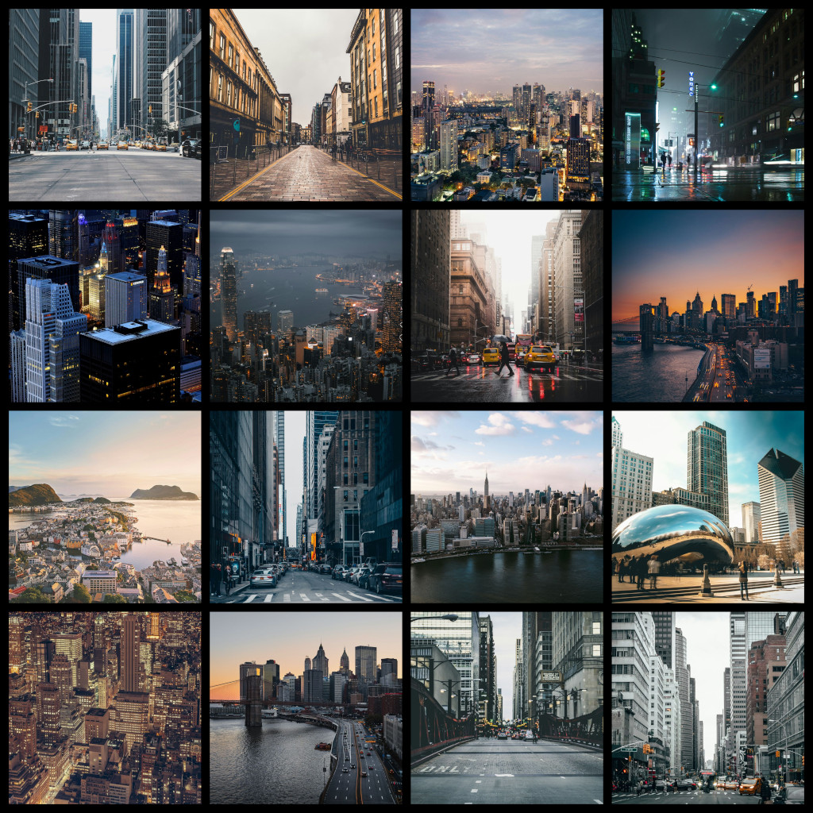
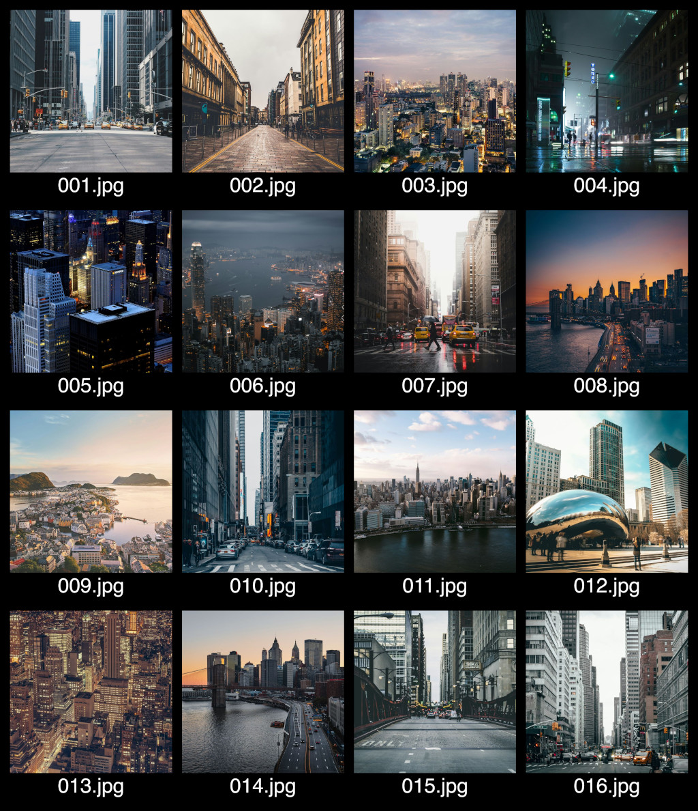
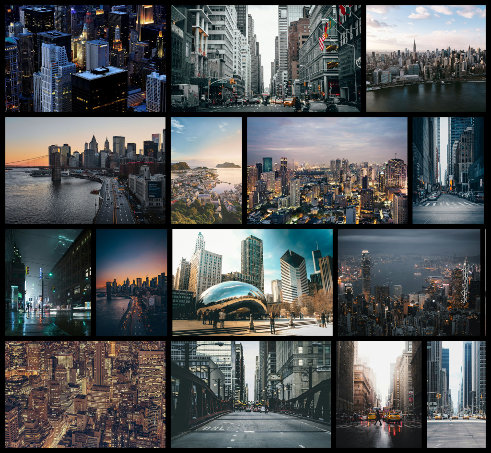
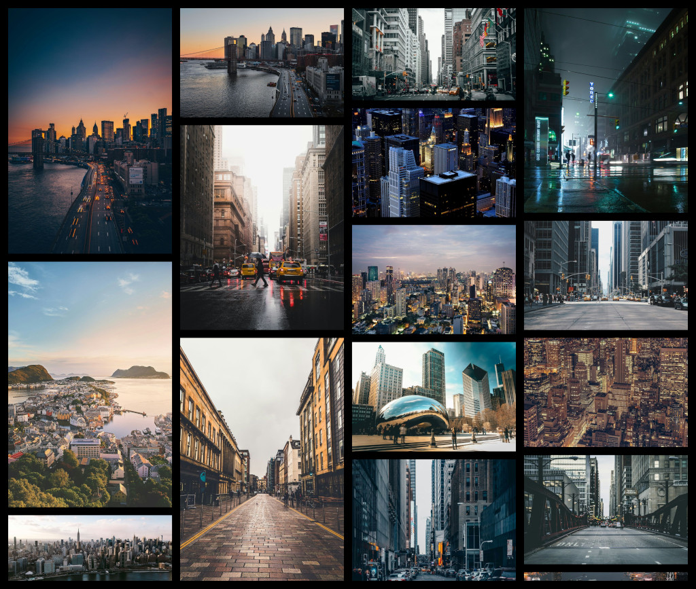
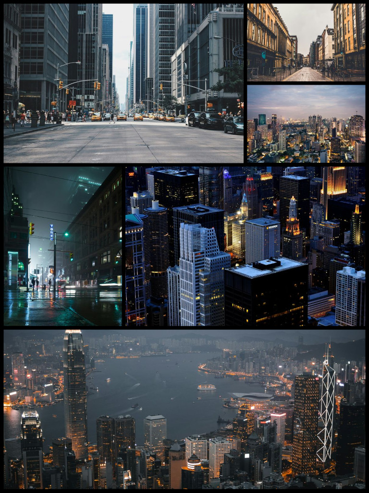
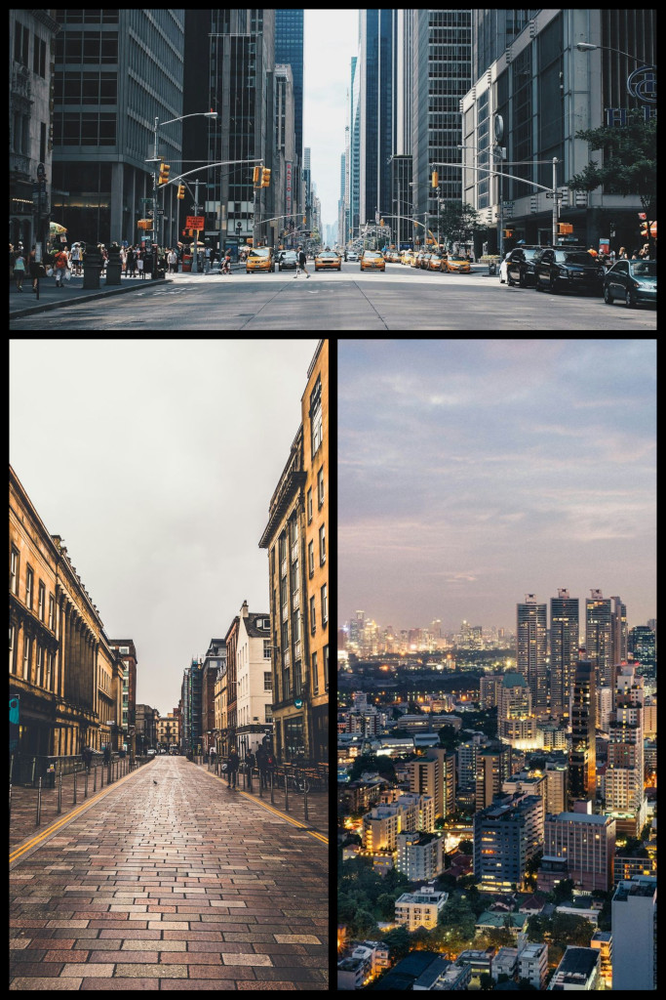
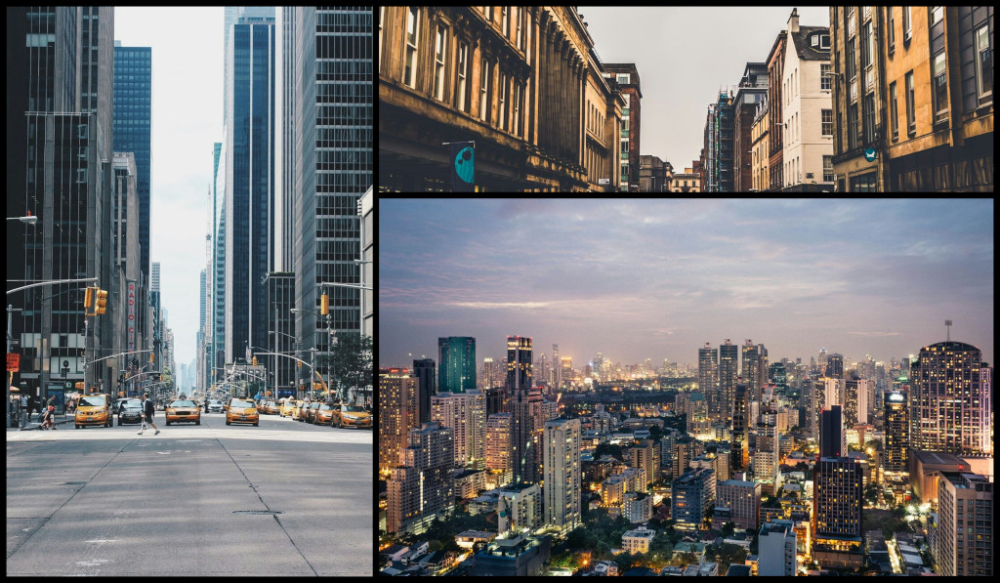
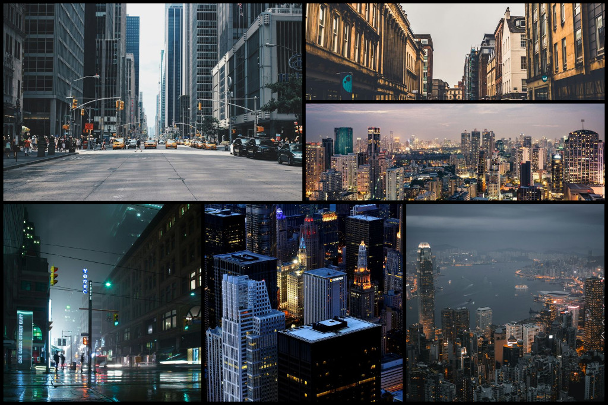
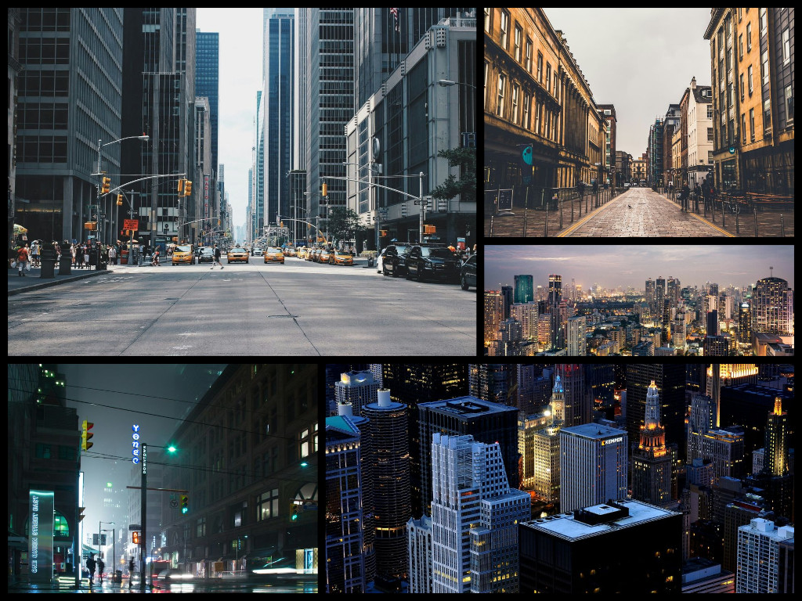
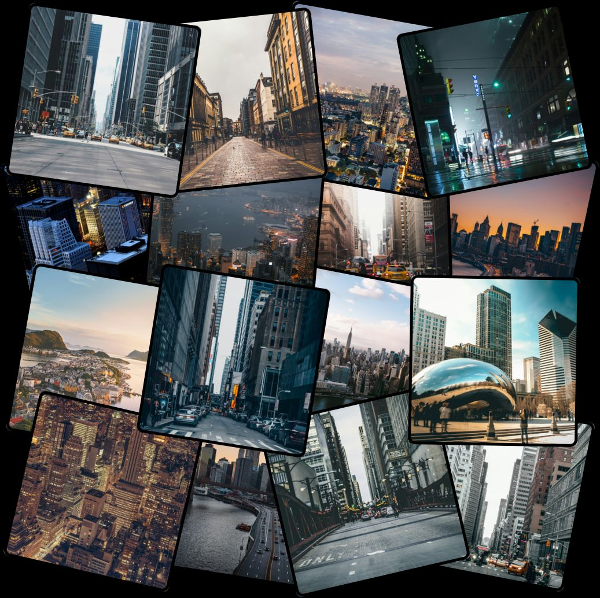

# Pixeli (Pre-release) [](https://www.npmjs.com/package/pixeli) [](./LICENSE)


**Pixeli** is a typescript-first, lightweight, and flexible command-line tool and library for merging multiple images into clean, customizable grid layouts. It’s designed for speed and simplicity, making it ideal for generating collages, previews, gallery layouts, inspiration boards, and composite images without relying on heavy desktop software.

Pixeli uses Sharp, a Node.js wrapper for the libvips library which is based on C. This makes it an extremely fast tool with support for PNG, JPG, GIF, SVG, AVIF, etc.

The tool currently supports four main layout modes: ***Grid***, ***Masonry*** (horizontal / vertical), ***Template***, and ***Collage***. Each of them provide a distinct visual style to match a project's needs, for example:

| Grid (1:1 images) | Contact Sheet Grid |
|---|---|
|  |  |
| **Masonry (Horizontal)** | **Masonry (Vertical)** |
|  |  |
| **Template (Instagram Grid)** | **Template (Vertical Book Spread)** |
|  |  |
| **Template (Horizontal Book Spread)** | **Template (Dashboard Shot)** |
|  |  |
| **Template (Art Gallery)** | **Collage** |
|  |  | 

# Table of Contents
1. [Installation](#installation)
2. [Quick CLI Examples](#quick-cli-examples)
    * [Basic Grid](#basic-grid)
    * [Grid with Rectangular Images](#grid-with-rectangular-images)
    * [Grid with 8 Columns](#grid-with-8-columns)
    * [Contact Sheet](#contact-sheet)
    * [Masonry Layout](#masonry-layout)
    * [Template Layout](#template-layout)
    * [Collage Layout](#collage-layout)
3. [Full CLI Documentation](#full-cli-documentation)
    * [pixeli](#pixeli)
    * [pixeli grid](#pixeli-grid)
    * [pixeli masonry](#pixeli-masonry)
    * [pixeli template](#pixeli-template)
    * [pixeli collage](#pixeli-collage)
4. [Full Library Documentation](#full-library-documentation)
    * [gridMerge Function Options](#gridmerge-function-options)
    * [masonryMerge Function Options](#masonrymerge-function-options)
    * [templateMerge Function Options](#templatemerge-function-options)
    * [collageMerge Function Options](#collagemerge-function-options)
5. [Other](#other)
    * [JSON Templates](#json-templates)
        * [Canvas](#canvas)
        * [Slots](#slots)
        * [Slot Rules](#slot-rules)
        * [Sample JSON Template](#sample-json-template)
    * [All Supported Input Formats](#all-supported-input-formats)
    * [All Supported Output Formats](#all-supported-output-formats)
    * [Pixel Limits](#pixel-limits)
    * [Colors and Transparency](#colors-and-transparency)
        * [CLI](#cli)
        * [Library](#library)
6. [License](#license)


## Installation
Pixeli can be installed using npm. Simply run the following command to install it globally on your machine:
```bash
npm i -g pixeli
```

If you're interested in the library functions and not the CLI, you can add it to your project instead of a global install:
```bash
npm i pixeli
```

You can also run pixeli directly with npx without installing it globally. This is convenient for quick experiments or one-off usage:
```bash
npx pixeli merge <subcommand> [options] <files...>
```

## Quick CLI Examples
To run these examples, you can visit the [GitHub Repository](https://github.com/pakdad-mousavi/pixeli) and use the images in the [Samples](https://github.com/pakdad-mousavi/pixeli/blob/main/samples/) directory, if you don't already have your own set of images.

All merge commands are under `pixeli` and can be used like so: `pixeli [merge-mode] [options]`

### Basic Grid
To create a basic grid with 1:1 images, you can use the grid merge command. You'll also need to provide the individual filepaths to use, or use the `-rd` (--recursive and --directory) flags to get all the images from the specified directory:
```bash
pixeli grid -rd ./samples/images
```

Without the `-r` flag, only the images in the directory will be scanned, and any sub-directories will be ignored.

### Grid with Rectangular Images
To create a grid with images that all have the same aspect ratio, you can specify the aspect ratio to use for all images using the `--ar` flag:
```bash
pixeli grid -rd ./samples/images --ar 16:9
```

### Grid with 8 Columns
You can also customize the number of columns that you'd like the final image to have using the `-c` flag, followed by the number of columns:
```bash
pixeli grid -rd ./samples/images -c 8
```

### Contact Sheet
Contact sheet style grids can also be made using pixeli. To include each file name under its respective image, the `--ca` flag can be used:
```bash
pixeli grid -rd ./samples/images --ca
```

The caption color can also be specified using the `--cc` flag, followed by a hex color:
```bash
pixeli grid -rd ./samples/images --ca --cc "#ff0000"
```

### Masonry Layout
To create a masonry style image, you can use the masonry merge command. The `-rd` flag is used to specify which directory to use, and the canvas width can be specified using the `--cvw` flag:
```bash
pixeli masonry -rd ./samples/images --cvw 4000
```

By default, the masonry merge command uses a horizontal flow, but a vertical one can be specified using the `-f` flag, followed by the `--cvh` to specify the canvas height:
```bash
pixeli merge masonry -rd ./samples/images -f vertical --cvh 4000
```

Note that the masonry command always requires either the `--cvw` or `--cvh` option, depending on the flow.

### Template Layout
Template layouts require a JSON template which describe your specific layout. The `-t` flag is used to specify the path to a JSON template:
```bash
pixeli template -rd ./samples/images -t ./template.json
```

You could also use one of the presets provided using the `-p` flag:
```bash
pixeli template -rd ./samples/images -p instagram-grid
```

To learn about the JSON template, see [JSON Templates](#json-templates).

### Collage Layout
Collage layouts are similar to grid layouts, in a way. Images are arranged in a grid, jittered, rotated, and overlapped to create a photo-wall style grid:
```bash
pixeli collage -rd ./samples/images
```

To customize the image sizes, use the `-w` flag:
```bash
pixeli collage -rd ./samples/images -w 400
```

To change the overlap percentage of any two images in the collage, use the `--op` flag:
```bash
pixeli collage -rd ./samples/images --op 10
```

For varying image sizes, you can use the `--wv` flag to change the image width variance (in pixels):
```bash
pixeli collage -rd ./samples/images --wv 50
```

To change the minimum and maximum degrees to rotate each image by, use the `--rr` flag to customize the rotation range:
```bash
pixeli collage -rd ./samples/images --rr 15
```

## Full CLI Documentation

### pixeli
Usage: `pixeli <subcommand> [options] <input...> -o <output>`

The `pixeli` command is what allows you to create grids and mosaics with your images.
| Subcommand | Description                                                                                                                                       | Options                                                          |
| ---------- | ------------------------------------------------------------------------------------------------------------------------------------------------- | ---------------------------------------------------------------- |
| `grid`     | Merge images into a **uniform rows × columns grid**, optionally with captions and per-image aspect ratios.                                        | See [grid options table](#pixeli-grid)                           |
| `masonry`  | Merge images into a **dynamic masonry layout**, preserving natural image proportions. Supports vertical or horizontal flow and alignment options. | See [masonry options table](#pixeli-masonry)                     |
| `template` | Merge images into a **pre-defined layout**, based on the template provided, or the preset used.                                                   | See [template options table](#pixeli-template)                   |
| `collage`  | Merge images into a **messy, photo-wall style grid**, great for posters or aesthetic layouts.                                                     | See [collage options table](#pixeli-collage)                     |

The following options and flags are shared for all of the subcommands under the `pixeli` command:
| Option                         | Default        | Description                                                                                                                        |
| ------------------------------ | -------------- | ---------------------------------------------------------------------------------------------------------------------------------- |
| `[files...]`                   | —              | Image file paths to merge. You can specify multiple files or if you prefer directories, use `--dir`.                               |
| `-d`, `--dir <path>`           | —              | Path to a **directory containing images** to merge. Can be used instead of listing files individually.                             |
| `-r`, `--recursive`            | `false`        | Include **images in all subdirectories** of the specified directory recursively.                                                   |
| `--sh`, `--shuffle`            | `false`        | **Randomize the order** of images before merging. Useful for creating visually varied grids or collages.                           |
| `-g`, `--gap <px>`             | `50`           | **Spacing (in pixels) between images** in the layout. Applies to both horizontal and vertical gaps.                                |
| `--cr`, `--corner-radius <px>` | `0`            | How much to **round the corners** of each image in pixels.                                                                         |
| `--bg`, `--canvas-color <hex>` | `#ffffff`      | Sets the **background color of the canvas**. Accepts HEX values (e.g., `#000000` for black).                                       |
| `--bw`, `--border-width <px>`  | `0`            | Sets the **width of the border** in pixels.                                                                                        |
| `--bc`, `--border-color <hex>` | `#000`         | Sets the **color of the border, if any**. Accepts HEX values (e.g., `#000000` for black).                                          |
| `-o`, `--output <file>`        | `./pixeli.png` | Path for the **merged output image**. The format is inferred from the file extension (`.png`, `.jpg`, `.webp`, etc.).              |


### pixeli grid
Usage: `pixeli grid [options] [files...]`

The grid merge arranges images into a clean, uniform grid with fixed columns and automatic row calculation. The table below displays all of the options available to this command:
| Option/Flag                                     | Default                | Description                                                                                                                                                                              |
| ----------------------------------------------- | ---------------------- | ---------------------------------------------------------------------------------------------------------------------------------------------------------------------------------------- |
| `--ar`, `--aspect-ratio <width/height\|number>` | `1:1`                  | Sets the **per-image aspect ratio**. Accepts ratio expressions (`16/9`, `4:3`) or decimal values (`1.777`). Images are scaled as needed to match this ratio before placement.            |
| `-w`, `--image-width <px>`                      | *smallest input width* | Sets the **final width of each processed image** in the grid. The height is derived automatically based on the chosen aspect ratio.                                                      |
| `-c`, `--columns <n>`                           | `4`                    | Defines how many **images per row** are placed in the grid. The total number of rows is calculated from the number of inputs.                                                            |
| `--ca`, `--caption`                             | `false`                | Enables **automatic captions** under each image. Captions are derived from the filename (with extensions).                                                                               |
| `--cc`, `--caption-color <hex>`                 | `#000000`              | HEX color value for caption text (e.g., `#ffffff`, `#ff9900`). Affects all captions uniformly.                                                                                           |
| `--mcs`, `--max-caption-size <pt>`              | `100`                  | Sets the **maximum allowed caption font size**. Useful when images are extremely large and the caption is not big enough. The renderer may auto-reduce the font size if necessary.       |

### pixeli masonry
Usage: `pixeli masonry [options] [files...]`

The masonry merge preserves each image’s natural shape, creating an organic brick-wall layout similar to Pinterest boards.

| Option/Flag                                          | Default                 | Description                                                                                                                                            |
| ---------------------------------------------------- | ----------------------- | ------------------------------------------------------------------------------------------------------------------------------------------------------ |
| `--rh`, `--row-height <px>`                          | *smallest input height* | Sets the **target height for all images in a row** when using `horizontal` flow. Images are scaled proportionally based on this height.                |
| `--cw`, `--column-width <px>`                        | *smallest input width*  | Sets the **target width for all images in a column** when using `vertical` flow. Images are scaled proportionally based on this width.                 |
| `--cvw`, `--canvas-width <px>`                       | –                       | Sets the **fixed width** of the final output canvas. Required when using a `horizontal` flow to know when to break a row.                              |
| `--cvh`, `--canvas-height <px>`                      | –                       | Sets the **fixed height** of the final output canvas. Required when using a `vertical` flow to know when to break a column.                            |
| `-f`, `--flow <horizontal\|vertical>`                | `horizontal`            | Determines the **flow direction** of the masonry layout. `horizontal` creates rows of varying widths; `vertical` creates columns of varying heights.   |
| `--ha`, `--h-align <left\|center\|right\|justified>` | `justified`             | Controls **horizontal alignment** of rows when in `horizontal` flow. `justified` overfills each row and crops the final image to fill up the canvas.   |
| `--va`, `--v-align <top\|middle\|bottom\|justified>` | `justified`             | Controls **vertical alignment** of columns when in `vertical` flow. `justified` overfills each column and crops the final image to fill up the canvas. |

### pixeli template
Usage: `pixeli template [options] [files...]`

The template merge requires a specified JSON template file, or JSON string. Images will be placed as per the template. If a preset ID is provided, both `--template` and `--mapping` are ignored.

| Option/Flag                                          | Default                 | Description                                                                                                                                                                                  |
| ---------------------------------------------------- | ----------------------- | -------------------------------------------------------------------------------------------------------------------------------------------------------------------------------------------- |
| `-t`, `--template <path>`                            | `null`                  | Sets the **path to the JSON template file** which will be used to arrange the collage. Either use `--template` or `--preset`.                                                                |
| `-p`, `--preset <preset-id>`                         | `null`                  | Use a **pre-defined collage preset** instead of providing your own. Available preset IDs: `instagram-grid`, `dashboardShot`, `horizontal-book-spread`, `vertical-book-spread`, `art-gallery` |

### pixeli collage
Usage: `pixeli collage [options] [files...]`

The collage merge arranges images into a messy, photo-wall style grid with fixed columns and automatic row calculation. The table below displays all of the options available to this command:

| Option/Flag                                     | Default                      | Description                                                                                                                                                                                                                                 |
| ----------------------------------------------- | ----------------------       | ------------------------------------------------------------------------------------------------------------------------------------------------------------------------------------------------------------------------------------------- |
| `--ar`, `--aspect-ratio <width/height\|number>` | `1:1`                        | Sets the **per-image aspect ratio**. Accepts ratio expressions (`16/9`, `4:3`) or decimal values (`1.777`). Images are scaled as needed to match this ratio before placement.                                                               |
| `-w`, `--image-width <px>`                      | *trimmed median image width* | Sets the **final width of each processed image** in the grid. The height is derived automatically based on the chosen aspect ratio.                                                                                                         |
| `-c`, `--columns <n>`                           | `4`                          | Defines how many **images per row** are placed in the grid. The total number of rows is calculated from the number of inputs.                                                                                                               |
| `--op`, `--overlap-percentage <percent>`        | `25`                         | Defines the **percentage of both vertical and horizontal overlap** between any two images. A higher percentage results in tighter, more packed collages.                                                                                    |
| `--rr`, `--rotation-range <deg>`                | `7`                          | Defines the **minimum and maximum rotation**. A random rotation of this amount in degrees will be applied to each image. For no rotation, a value of `0` can be used.                                                                       |
| `--wv`, `--image-width-variance <px>`           | `10`                         | Defines the **random variation in image width** that is added to each image width (image height variance is automatically calculated). This helps create more natural collages. A larger image variance results in more uneven image sizes. |

## Full Library Documentation

Pixeli also provides functions for every merge. They can be imported like so:


```javascript
import { gridMerge, masonryMerge, templageMerge, collageMerge } from 'pixeli';
```

All merge functions have the following signature:

```typescript
interface MergeCommand<T> {
  (
  imageInputs: sharp.SharpInput[],
  options: T,
  onProgress?: (total: number, completed: number, phase: string): void;
  ): Promise<Buffer>;
}
```

The `imageInputs` parameter takes an array of valid image inputs which will be processed by sharp to create sharp instances. An image input can be a `Buffer` object, any subclass of `Buffer`, a file path string, or any other input type supported by the Sharp `SharpInput` interface.

The `options` parameter is where merge-specific options are given as an object. Each merge function has their own set of supported options.

The `onProgress` parameter is optional. It is a callback function which is called everytime progress is made during a merge operation. If provided, it will receive a `ProgressInfo` object, which contains the total number of images to be processed, the number of completed images so far, and the current phase of the merge (e.g., "Merging images" or "Initializing").

⚠️ NOTE ⚠️: The `onProgress` callback will be changed in upcoming versions.

The returned value of the function, if successful, is a buffer containing the final mosaic. If not successful, a `MergeError` will be thrown. To learn more about error handling, see ***wopuhfewopifhvweproihvfewpoihv*** MergeErrors.

### gridMerge Function Options

The `gridMerge` function has the following set of options:

| Option           | Data Type             | Description                                                                                                                        |
| ---------------- | --------------------- | ---------------------------------------------------------------------------------------------------------------------------------- |
| `shuffle`        | `boolean`             | Whether to randomize the image order before merging.                                                                               |
| `cornerRadius`   | `number`              | Rounded corner radius in pixels applied to each image.                                                                             |
| `gap`            | `number`              | Gap between images in pixels.                                                                                                      |
| `canvasColor`    | `Color`               | Background color of the output canvas.                                                                                             |
| `borderWidth`    | `number`              | Width of the border around each image in pixels. Borders are drawn internally within each image.                                   |
| `borderColor`    | `Color`               | Color of the border around each image.                                                                                             |
| `format`         | `string`              | Output image format (e.g., `png`, `jpeg`, `webp`).                                                                                 |
| `aspectRatio`    | `string \| number`    | Aspect ratio of each image cell. Used to calculate image height based on the given width. Examples: `"16:9"`, `"3x2"`, or `1.777`. |
| `imageWidth`     | `number \| undefined` | Width of each image cell in pixels. If undefined, the median width of the input images is used.                                    |
| `columns`        | `number`              | Number of columns in the grid layout.                                                                                              |
| `caption`        | `boolean`             | Whether to render captions under images.                                                                                           |
| `captions`       | `string[]`            | Caption text for each image, in order.                                                                                             |
| `captionColor`   | `Color`               | Text color used for image captions.                                                                                                |
| `maxCaptionSize` | `number`              | Maximum caption font size in pixels.                                                                                               |

### masonryMerge Function Options

The `masonryMerge` function has the following set of options:

| Option         | Data Type                                      | Description                                                                                                                 |
| -------------- | ---------------------------------------------- | --------------------------------------------------------------------------------------------------------------------------- |
| `shuffle`      | `boolean`                                      | Whether to randomize the image order before merging.                                                                        |
| `cornerRadius` | `number`                                       | Rounded corner radius in pixels applied to each image.                                                                      |
| `gap`          | `number`                                       | Gap between images in pixels.                                                                                               |
| `canvasColor`  | `Color`                                        | Background color of the output canvas.                                                                                      |
| `borderWidth`  | `number`                                       | Width of the border around each image in pixels. Borders are drawn internally within each image.                            |
| `borderColor`  | `Color`                                        | Color of the border around each image.                                                                                      |
| `format`       | `string`                                       | Output image format (e.g., `png`, `jpeg`, `webp`).                                                                          |
| `rowHeight`    | `number \| undefined`                          | Height of each row in pixels. Defaults to the trimmed median image height if undefined. Only applied in horizontal layouts. |
| `columnWidth`  | `number \| undefined`                          | Width of each column in pixels. Defaults to the trimmed median image width if undefined. Only applied in vertical layouts.  |
| `canvasWidth`  | `number \| undefined`                          | Width of the entire output canvas in pixels. Required when using horizontal flow.                                           |
| `canvasHeight` | `number \| undefined`                          | Height of the entire output canvas in pixels. Required when using vertical flow.                                            |
| `flow`         | `'horizontal' \| 'vertical'`                   | Orientation of the masonry layout. Determines whether items flow by rows (horizontal) or by columns (vertical).             |
| `hAlign`       | `'left' \| 'center' \| 'right' \| 'justified'` | Horizontal alignment of items within each row. Only applied in horizontal layouts.                                          |
| `vAlign`       | `'top' \| 'middle' \| 'bottom' \| 'justified'` | Vertical alignment of items within each column. Only applied in vertical layouts.                                           |

### templateMerge Function Options

The `templateMerge` function has the following set of options:

| Option         | Data Type  | Description                                                                                                                                                    |
| -------------- | ---------- | -------------------------------------------------------------------------------------------------------------------------------------------------------------- |
| `shuffle`      | `boolean`  | Whether to randomize the image order before merging.                                                                                                           |
| `cornerRadius` | `number`   | Rounded corner radius in pixels applied to each image.                                                                                                         |
| `gap`          | `number`   | Gap between images in pixels.                                                                                                                                  |
| `canvasColor`  | `Color`    | Background color of the output canvas.                                                                                                                         |
| `borderWidth`  | `number`   | Width of the border around each image in pixels. Borders are drawn internally within each image.                                                               |
| `borderColor`  | `Color`    | Color of the border around each image.                                                                                                                         |
| `format`       | `string`   | Output image format (e.g., `png`, `jpeg`, `webp`).                                                                                                             |
| `template`     | `Template` | An object definition describing the layout, slots, and canvas configuration used to place images. See [JSON Templates](#json-templates) for more information.  |

### collageMerge Function Options

The `collageMerge` function has the following set of options:

| Option               | Data Type          | Description                                                                                                                                                                                    |
| -------------------- | ------------------ | ---------------------------------------------------------------------------------------------------------------------------------------------------------------------------------------------- |
| `shuffle`            | `boolean`          | Whether to randomize the image order before merging.                                                                                                                                           |
| `cornerRadius`       | `number`           | Rounded corner radius in pixels applied to each image.                                                                                                                                         |
| `canvasColor`        | `Color`            | Background color of the output canvas.                                                                                                                                                         |
| `borderWidth`        | `number`           | Width of the border around each image in pixels. Borders are drawn internally within each image.                                                                                               |
| `borderColor`        | `Color`            | Color of the border around each image.                                                                                                                                                         |
| `format`             | `string`           | Output image format (e.g., `png`, `jpeg`, `webp`).                                                                                                                                             |
| `imageWidth`         | `number`           | Width of each image cell in pixels. If undefined, the median input image width is used.                                                                                                        |
| `aspectRatio`        | `string \| number` | Aspect ratio used to calculate image height from width. Examples: `"16:9"`, `"3x2"`, or `1.777`.                                                                                               |
| `columns`            | `number`           | Number of columns in the collage grid.                                                                                                                                                         |
| `imageWidthVariance` | `number`           | Maximum number of pixels that each image width may randomly vary from `imageWidth`, creating natural size variation. For example, `50` allows images to be up to ±50 pixels wider or narrower. |
| `overlapPercentage`  | `number`           | Estimated percentage of overlap between neighboring images. Higher values create a tighter, denser collage.                                                                                    |
| `rotationRange`      | `number`           | Maximum absolute rotation angle in degrees. A value of `10` produces a random rotation between `-10°` and `+10°`.                                                                              |

## Other

### JSON Templates
JSON templates used with template merge accept a JSON object that defines a grid-based canvas layout and how content occupies it.

The layout consists of:

- A canvas definition (overall grid size)
- A list of slots describing how items are placed inside the grid

Logical checks are performed on the values after the template is validated. This is to ensure the mosaic can be created, for example, without any overlaps or 0 pixel-wide images.

#### canvas

The **canvas** object defines the size and structure of the grid:
```json
{
  "canvas": {
    "width": 1200,
    "height": 800,
    "columns": 4,
    "rows": 3
  }
}
```

| Field     | Type   | Description                                          |
| --------- | ------ | ---------------------------------------------------- |
| `width`   | number | Canvas width in pixels. Must be a positive integer.  |
| `height`  | number | Canvas height in pixels. Must be a positive integer. |
| `columns` | number | Number of grid columns. Must be a positive integer.  |
| `rows`    | number | Number of grid rows. Must be a positive integer.     |

#### slots

The **slots** array contains a series of slots, where each slot defines where an item should appear in the grid and how many grid cells it occupies:

```json
{
  "slots": [
    { "col": 1, "row": 1, "colSpan": 2, "rowSpan": 1 },
    { "col": 3, "row": 2, "colSpan": 1, "rowSpan": 2 }
  ]
}
```

| Field     | Type   | Description                       |
| --------- | ------ | --------------------------------- |
| `col`     | number | Starting column index (1-based).  |
| `row`     | number | Starting row index (1-based).     |
| `colSpan` | number | Number of columns the slot spans. |
| `rowSpan` | number | Number of rows the slot spans.    |

#### Slot Rules

- All values must be positive integers.
- Slots must fit within the grid:
```
col + colSpan - 1 ≤ columns
row + rowSpan - 1 ≤ rows
```
- Overlapping slots will be rejected.
- Slot indices start at 1, not 0.

#### Sample JSON Template

This is an example of a full JSON template:
```json
{
  "canvas": {
    "width": 1200,
    "height": 1600,
    "columns": 3,
    "rows": 6,
  },
  "slots": [
    { "col": 1, "row": 1, "colSpan": 2, "rowSpan": 2 },
    { "col": 3, "row": 1, "colSpan": 1, "rowSpan": 1 },
    { "col": 3, "row": 2, "colSpan": 1, "rowSpan": 1 },
    { "col": 1, "row": 3, "colSpan": 1, "rowSpan": 2 },
    { "col": 2, "row": 3, "colSpan": 2, "rowSpan": 2 },
    { "col": 1, "row": 5, "colSpan": 3, "rowSpan": 2 }
  ]
}
```

Note that the `canvas.background` and `canvas.gap` properties are optional. If they are not provided, the defaults from the CLI options will be used. If both the CLI and template options exists, the template options take priority.

### All Supported Input Formats

- ***webp***
- ***gif***
- ***jpeg***
- ***jpg***
- ***png*** 
- ***tiff***
- ***avif***
- ***svg***

### All Supported Output Formats

- ***webp***
- ***gif***
- ***jpeg***
- ***jpg***
- ***png*** 
- ***tiff***
- ***avif***

### Pixel Limits

Generating extremely large images significantly reduces speed, and may also lead to pixel limit errors. All image formats have a maximum width and height, and if the created image exceeds those resolution limits, you will receive an error:

| Format                       | Typical Extension(s) | Max Width × Height                                   | Notes                                                                                              |
| ---------------------------- | -------------------- | ---------------------------------------------------- | -------------------------------------------------------------------------------------------------- |
| **JPEG / JPG**               | `.jpg`, `.jpeg`      | **65,535 × 65,535 px**                               | Standard limit from JFIF/JPEG. No alpha.                                                           |
| **PNG**                      | `.png`               | **~2,147,483,647 × 2,147,483,647 px**                | Theoretical spec limit; real-world memory limits apply. Supports transparency.                     |
| **WebP**                     | `.webp`              | **16,383 × 16,383 px**                               | Format standard limit — smaller than PNG/JPEG.                                                     |
| **GIF**                      | `.gif`               | **65,536 × 65,536 px**                               | -                                                                                                  |
| **BMP**                      | `.bmp`               | **32,767×32,767 or ~2,147,483,647×2,147,483,647 px** | Depends on version/fields.                                                                         |
| **TIFF**                     | `.tif`, `.tiff`      | **4,294,967,295 × 4,294,967,295 px** (theoretical)   | Very large; may be limited by software or memory.                                                  |

### Colors and Transparency

#### CLI
Hex colors are used in the CLI.

For fully transparent images, a value of `transparent` is allowed. Note that the transparency of the canvas itself is depends on the output format; `jpg`, for example, does not have an alpha channel.

Semi-transparency is also allowed, and can be achieved with hex colors of the format `#rrggbbaa`, where the last two hex values represent the transparency.

#### Library
Colors in the library functions are either objects or hex values. The `Color` type is used to describe colors:

```typescript
type Color = { r: number; g: number; b: number; alpha: number } | string;
```

Given that a color object has been used instead of a hex value, note that `color.r`, `color.g`, and `color.b` are all values ranging from 0 to 255, while `color.alpha` is a value ranging from 0 to 1. 

## License
This project is licensed under the [MIT License](./LICENSE).